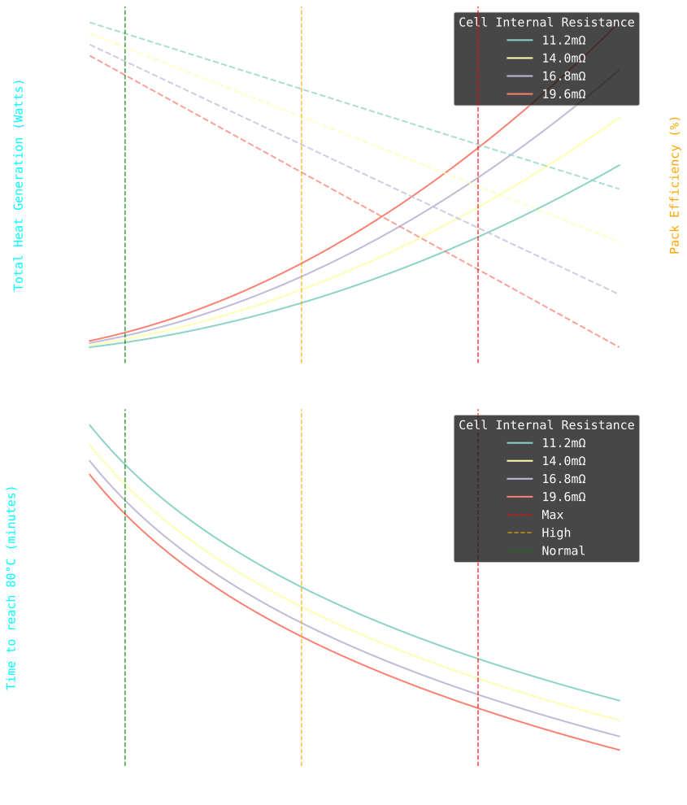
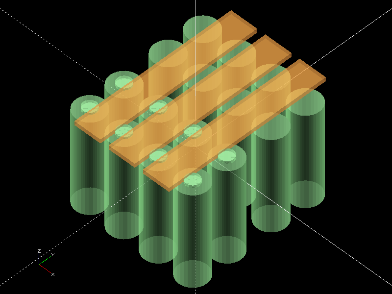
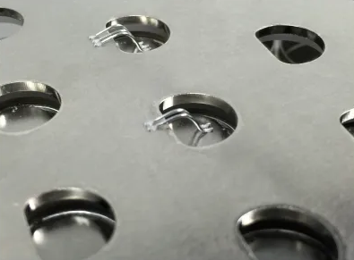

#+OPTIONS: \n:t
#+TITLE: Battery Design
#+LANGUAGE: en
#+AUTHOR: Ivan Nikolic
#+DATE: [2024-12-02 Mon]
#+LAST_MODIFIED: [2024-12-21 Sat]

* Cell selection

Collecting data on the individual cells from https://eu.nkon.nl/

#+NAME: cells
| Name                 | Price (EUR) | Cap (Ah) | Weight (g) | Max (A) |  Type | Height (mm) | D (mm) |
|----------------------+-------------+----------+------------+---------+-------+-------------+--------|
| LG INR18650MH1       |        2.75 |    3.100 |         47 |       6 | 18650 |        64.5 |     18 |
| Sanyo NCR18650GA     |         3.9 |    3.450 |         47 |      10 | 18650 |          65 |     18 |
| Keeppower IMR26650   |        8.95 |    5.200 |       93.9 |      15 | 26650 |          67 |     26 |
| Keeppower 26650      |        9.45 |    5.200 |         97 |      10 | 26650 |             |        |
| Lishen LR2170SD      |         3.8 |    4.800 |         73 |     9.6 | 21700 |        70.9 |   21.7 |
| Samsung INR21700     |        5.65 |    5.200 |         67 |      15 | 21700 |        70.6 |  21.27 |
| Samsung INR21700-50S |        3.16 |        5 |         72 |      35 | 21700 |        70.6 |  21.25 |
| Headway LifePO4      |          15 |   10.000 |        346 |      20 | 38120 |             |        |

* Full battery output/price calculation

How many cells do I need to go in series to achieve min 3kWh capacity, then calculate max amps, weight etc

#+BEGIN_SRC python :var tab=cells :colnames yes :hlines yes :results table :exports both
import math

cell_voltage = 4.2
cell_series = 20
target_kwh = 3

def process(row):
    [name, price, capacity, weight, maxA, batt_type, height, diam] = row

    # full battery voltage (aiming for 72/84v)
    total_voltage = (cell_voltage * cell_series)
    
    # required capacity (Ah) of a single series stage to achieve target kWh
    single_series_ah = (target_kwh * 1000) / total_voltage
    
    # number of cells required in each stage
    P = math.ceil(single_series_ah / capacity)
    
    # total battery kWh
    kWh = (P *  capacity * total_voltage) / 1000

    # total cells in the battery
    cell_n = P * 20

    # full price, weight
    total_price = round(cell_n * price)
    total_weight = round(cell_n * weight) / 1000

    # max safe discharge
    total_maxA = P * maxA

    return [name, P, kWh, total_price, total_weight, total_maxA, cell_n]

return([['Name', '20SxP', 'kWh', 'Price (EUR)', 'Weight (Kg)', 'Max (A)', 'Cell Count']] + 
       [process(row) for row in tab])

#+END_SRC
#+RESULTS:
| Name                 | 20SxP |    kWh | Price (EUR) | Weight (Kg) | Max (A) | Cell Count |
|----------------------+-------+--------+-------------+-------------+---------+------------|
| LG INR18650MH1       |    12 | 3.1248 |         660 |       11.28 |      72 |        240 |
| Sanyo NCR18650GA     |    11 | 3.1878 |         858 |       10.34 |     110 |        220 |
| Keeppower IMR26650   |     7 | 3.0576 |        1253 |      13.146 |     105 |        140 |
| Keeppower 26650      |     7 | 3.0576 |        1323 |       13.58 |      70 |        140 |
| Lishen LR2170SD      |     8 | 3.2256 |         608 |       11.68 |    76.8 |        160 |
| Samsung INR21700-50S |     8 |   3.36 |         506 |       11.52 |     280 |        160 |
| Headway LifePO4      |     4 |   3.36 |        1200 |       27.68 |      80 |         80 |

Samsung INR21700 seems most promising:
- low price
- only 8 cells in series
- best performance in terms of max output (A) (implies very fast charging as well)
  
Building a 8P20S battery,
Max continuous discharge of 150A giving 7.2/8.4kw - 10/12.6kw

* Cell heating and losses

Need to figure out what sort of cooling I need for this
#+BEGIN_SRC python :results output :session cells :exports both
from sympy import Symbol, solve, expand, pi

# Base parameters as symbols
n_parallel = Symbol('n_p')     # number of cells in parallel
n_series = Symbol('n_s')       # number of cells in series
current = Symbol('I')          # total current (A)
cell_ir = Symbol('R_cell')     # internal resistance per cell (ohm)
temperature = Symbol('T')      # cell temperature (°C)
voltage = Symbol('V')          # pack voltage (V)
ambient_temp = Symbol('T_a')   # ambient temperature (°C)

# Constants for Samsung 50S
CELL_IR = 0.014               # 14mΩ internal resistance
CELL_VOLTAGE = 3.6            # nominal voltage
CELL_CAPACITY = 5.0           # Ah
CELL_MASS = 0.072             # kg
CELL_SPEC_HEAT = 850          # J/g°C
THERMAL_CUTOFF = 80           # °C
THERMAL_RELEASE = 60          # °C

# Core relationships
cells_total = n_series * n_parallel
current_per_cell = current / n_parallel
pack_voltage = n_series * voltage

# Power and heat calculations
cell_power_loss = current_per_cell**2 * cell_ir
pack_power_loss = cell_power_loss * cells_total
pack_power = current * pack_voltage
efficiency = (pack_power - pack_power_loss) / pack_power * 100

# Temperature rise calculations (simplified)
# Assuming natural air cooling
heat_transfer_coeff = 10  # W/(m²·K) for natural convection
cell_surface_area = 0.004  # m² (approximate for 21700)
temp_rise = cell_power_loss / (heat_transfer_coeff * cell_surface_area)

config = {
    n_parallel: 8,
    n_series: 20,
    cell_ir: CELL_IR,
    voltage: CELL_VOLTAGE,
    ambient_temp: 40
}

def format_time(x,_=None):
   """Convert minutes to appropriate units with smart formatting"""
   if x < 60:
       return f'{x*60:.0f}s'
   elif x < (3600):
      minutes = x / 60
      return f'{minutes:.0f}min'
   else:
       hours = x/(3600)
       if hours < 24:
           return f'{hours:.1f}h'
       else:
           days = hours/24
           return f'{days:.1f}d'

def calculate_losses(total_current):
    """Calculate losses for a given current"""
    subs_dict = {**config, current: total_current}
    
    heat_per_cell = cell_power_loss.subs(subs_dict)
    total_heat = pack_power_loss.subs(subs_dict)
    eff = efficiency.subs(subs_dict)
    temp_increase = temp_rise.subs(subs_dict)
    
    print(f"At {total_current}A total current:")
    print(f"Current per cell: {total_current/config[n_parallel]:.2f}A")
    print(f"Heat generation per cell: {heat_per_cell:.2f}W")
    print(f"Pack efficiency: {eff:.2f}%")
    print(f"Estimated temp rise above ambient: {temp_increase:.2f}°C")
    print(f"Time to reach {THERMAL_CUTOFF}°C (no cooling): {format_time((THERMAL_CUTOFF - 20) * CELL_MASS * CELL_SPEC_HEAT / heat_per_cell)}")
    print("")

# Test different currents
for test_current in [90, 150]:
    calculate_losses(test_current)
#+END_SRC

#+RESULTS:
#+begin_example
At 90A total current:
Current per cell: 11.25A
Heat generation per cell: 1.77W
Pack efficiency: 95.62%
Estimated temp rise above ambient: 44.30°C
Time to reach 80°C (no cooling): 35min

At 150A total current:
Current per cell: 18.75A
Heat generation per cell: 4.92W
Pack efficiency: 92.71%
Estimated temp rise above ambient: 123.05°C
Time to reach 80°C (no cooling): 12min
#+end_example

#+BEGIN_SRC python :results file :session cells :exports both
import numpy as np
import matplotlib.pyplot as plt
from matplotlib.ticker import MultipleLocator, FuncFormatter, LogLocator

# Setup plot style
plt.style.use('dark_background')
plt.rcParams['font.family'] = 'monospace'
plt.rcParams['font.size'] = 15

# Battery parameters
CELL_IR = 0.014  # 14mΩ
N_PARALLEL = 8
CELL_VOLTAGE = 3.6
N_SERIES = 20
PACK_VOLTAGE = CELL_VOLTAGE * N_SERIES
CELL_MASS = 0.072  # kg
CELL_SPEC_HEAT = 850  # J/kg°C
T_AMBIENT = 40  # °C
T_MAX = 80  # °C
DELTA_T = T_MAX - T_AMBIENT  # Temperature rise to reach 80°C

# Create figure with multiple subplots
fig, (ax1, ax3) = plt.subplots(2, 1, figsize=(12, 14))
ax2 = ax1.twinx()

# Define current range (starting from small non-zero value)
currents = np.linspace(40, 190, 100)
current_per_cell = currents / N_PARALLEL

# Calculate for different internal resistances
for ir_mult in [0.8, 1.0, 1.2, 1.4]:
   resistance = CELL_IR * ir_mult
   
   # Calculate losses
   cell_losses = (current_per_cell**2 * resistance)
   pack_losses = cell_losses * (N_PARALLEL * N_SERIES)
   pack_power = currents * PACK_VOLTAGE
   efficiency = 100 * (1 - pack_losses/pack_power)
   
   # Calculate time to reach 80°C (assuming adiabatic heating)
   energy_needed = CELL_MASS * CELL_SPEC_HEAT * DELTA_T  # Joules needed per cell
   time_to_80deg = energy_needed / cell_losses  # seconds
   
   # Plot power losses and efficiency
   line1 = ax1.plot(
       currents, 
       pack_losses,
       linewidth=2,
       label=f'{ir_mult*CELL_IR*1000:.1f}mΩ'
   )
   
   line2 = ax2.plot(
       currents,
       efficiency,
       linewidth=2,
      alpha=0.75,
      linestyle='--'
   )
   
   # Plot time to reach 80°C
   line3 = ax3.plot(
       currents,
       time_to_80deg,
       linewidth=2,
       label=f'{ir_mult*CELL_IR*1000:.1f}mΩ'
   )

# Configure top plot
ax1.set_xlabel('Pack Current (A)')
ax1.set_ylabel('Total Heat Generation (Watts)', color='cyan')
ax2.set_ylabel('Pack Efficiency (%)', color='orange')

ax2.axvline(x=150, color='red', linestyle='--', alpha=0.75, label='Max')
ax2.axvline(x=100, color='orange', linestyle='--', alpha=0.75, label='High')
ax2.axvline(x=50, color='green', linestyle='--', alpha=0.75, label='Normal')

# Configure bottom plot
ax3.set_xlabel('Pack Current (A)')
ax3.set_ylabel('Time to reach 80°C (minutes)', color='cyan')
ax3.set_yscale('log')  # Use log scale for time
ax3.yaxis.set_major_formatter(FuncFormatter(format_time))
ax3.yaxis.set_major_locator(LogLocator(base=1.1))

# Add grids
ax1.grid(True, which="major", ls="-", alpha=0.3)
ax1.grid(True, which="minor", ls=":", alpha=0.2)
ax3.grid(True, which="major", ls="-", alpha=0.3)
ax3.grid(True, which="minor", ls=":", alpha=0.2)

ax3.axvline(x=150, color='red', linestyle='--', alpha=0.75, label='Max')
ax3.axvline(x=100, color='orange', linestyle='--', alpha=0.75, label='High')
ax3.axvline(x=50, color='green', linestyle='--', alpha=0.75, label='Normal')

# Set axis intervals
ax1.xaxis.set_major_locator(MultipleLocator(10))
ax1.yaxis.set_major_locator(MultipleLocator(200))
ax3.xaxis.set_major_locator(MultipleLocator(20))

# Add legends
legend1 = ax1.legend(title='Cell Internal Resistance', loc='upper right')
legend3 = ax3.legend(title='Cell Internal Resistance', loc='upper right')
frame1 = legend1.get_frame()
frame3 = legend3.get_frame()
frame1.set_facecolor('none')
frame1.set_facecolor((0.1, 0.1, 0.1, 0.5))
frame3.set_facecolor((0.1, 0.1, 0.1, 0.5))

plt.tight_layout()

# Save and return
plt.savefig('battery_thermal.svg', dpi=150, bbox_inches='tight', format='svg', transparent=True)
'battery_thermal.svg'
#+END_SRC
#+RESULTS:

* Copper bus bar and cabling

We need to determine optimal current density (A/mm²)

- Constraints here are cable temperature increase and energy loss (W)
- Copper resistivity at 20°C (ρ₀) = 1.68 * 10⁻⁸Ωm (or 0.0168 Ω⋅mm²/m)
- Resistivity scales linearly with temperature ρ(T) = ρ₀[1 + α(T - T₀)]

Building a model of the wire using sympy

#+BEGIN_SRC python :results none :exports code :session cablecalc
from sympy import Symbol, solve, init_printing, expand, sqrt, pi
from sympy.utilities.lambdify import lambdify

# Define base physical parameters as symbols
length = Symbol('L')        # meters
area_mm2 = Symbol('A')      # mm²
temperature = Symbol('T')   # °C
current = Symbol('I')       # Amperes
voltage = Symbol('V')       # Volts
rho_0 = Symbol('ρ')         # resistivity
alpha = Symbol('α')         # temperature coefficient
delta_T = Symbol('ΔT')      # temperature change

# Constants
# Copper
rho_copper = 1.68e-8     # Reference resistivity
alpha_copper = 0.00393   # Temperature coefficient
material_copper = { rho_0: rho_copper, alpha: alpha_copper }

# Nickel
rho_nickel = 6.99e-8      # Reference resistivity
alpha_nickel = 0.006      # Temperature coefficient
material_nickel = { rho_0: rho_nickel, alpha: alpha_nickel }

heat_transfer_coefficient = 5  # W/(m²·°C)
T_0 = 20                       # Reference temperature

# Core relationships
area_m2 = area_mm2 * 1e-6
resistivity = rho_0 * (1 + alpha * (temperature - T_0))
resistance = (resistivity * length) / area_m2
resistance_mili = resistance * 1000
power_loss = current**2 * resistance
current_density = current / area_mm2
power = current * voltage
power_loss_percent = (power_loss / power) * 100
diameter_mm = sqrt(area_mm2 / pi) * 2
diameter_m = diameter_mm * 1e-3
surface_area = pi * diameter_m * length
delta_t = (resistance * current * current) / (surface_area * heat_transfer_coefficient)

# Running some tests
import numpy as np
import inspect

print(resistance.subs([(temperature, 30), (length, 2), (area_mm2, 100)]))

resistance_fn = lambdify([length, area_mm2, temperature], resistance)
print(inspect.signature(resistance_fn))
print(resistance_fn(2, 100, np.linspace(-20,100,5)))
#+END_SRC
#+BEGIN_SRC python :results none :exports none :session cablecalc
from typing import Dict, List, Union

def compute(known_values: Dict[Symbol, Union[float, np.ndarray]], 
           targets: List[Symbol]):
    # 1. Analyze what symbols are needed for each target
    def get_free_symbols(expr):
        if hasattr(expr, 'free_symbols'):
            return expr.free_symbols
        return set()
    
    needed_symbols = set()
    for target in targets:
        needed_symbols.update(get_free_symbols(target))
    
    # 2. Check if we can compute numerically
    missing_symbols = needed_symbols - set(known_values.keys())
    if missing_symbols:
        raise Exception("missing symbols " + missing_symbols)
    
    # 3. Create vectorized functions
    all_symbols = tuple(needed_symbols)  # Fix the order of all symbols
    numeric_funcs = {
        target: lambdify(all_symbols, target, 'numpy')
        for target in targets
    }
    
    # 4. Set up parameter grids for array inputs
    array_inputs = {sym: val for sym, val in known_values.items() 
                   if isinstance(val, np.ndarray)}
    if array_inputs:
        grid_arrays = np.meshgrid(*[val for val in array_inputs.values()])
        grid_dict = dict(zip(array_inputs.keys(), grid_arrays))
        eval_dict = {**known_values, **grid_dict}
    else:
        eval_dict = known_values
    
    args = [eval_dict[sym] for sym in all_symbols]
    return [ numeric_funcs[target](*args) for target in targets ]

# Test cases
temps = np.linspace(-20, 100, 5)
voltages = np.linspace(48, 84, 3)

one, two = compute(
    {**material_copper, temperature: temps, current: 150, voltage: voltages, 
     length: 2, area_mm2: 100},
    [ power_loss_percent, power_loss ],
)

print(one)
print(two)
#+END_SRC

How do the power losses change with ambient temperatures and cable cross section?

- temp: [-20°C, 100°C]
- cable crosssection: [25mm², 200mm²]
- length: 2m
- power 12kW (where I = 150A, V = 84V)

#+BEGIN_SRC python :results file :exports both :session cablecalc
import numpy as np
import matplotlib.pyplot as plt
from matplotlib.ticker import MultipleLocator

# Setup plot style
plt.style.use('dark_background')
plt.rcParams['font.family'] = 'monospace'
plt.rcParams['font.size'] = 15

# Define parameter ranges
values = {
    **material_copper,
    area_mm2: np.linspace(25, 200, 20),
    current: 150,
    voltage: 84,
    length: 2
 }

# Create figure with primary and secondary y-axes
fig, ax1 = plt.subplots(figsize=(12, 7))
ax2 = ax1.twinx()

# fig.patch.set_alpha(0.0)
# ax1.patch.set_alpha(0.0)
# ax2.patch.set_alpha(0.0)

# Plot lines for each temperature
for temp in np.linspace(-20, 100, 4):
    loss, perc = compute({ **values, temperature: temp }, [ power_loss, power_loss_percent])
    
    line1 = ax1.plot(
        values[area_mm2],
        loss,
        linewidth=2, label=f'{temp:.0f}°C')
    
    line2 = ax2.plot(
        values[area_mm2],
        perc,
        linewidth=0, color='orange')

# Configure axes
ax1.set_xlabel('Cable Cross-sectional Area (mm²)')
ax1.set_ylabel('Power Loss (Watts)', color='cyan')
ax2.set_ylabel('Loss Percentage (%)', color='orange')

# Add grid
ax1.grid(True, which="major", ls="-", alpha=0.3)
ax1.grid(True, which="minor", ls=":", alpha=0.2)

# Set axis intervals
ax1.xaxis.set_major_locator(MultipleLocator(10))
ax1.yaxis.set_major_locator(MultipleLocator(5))

# Add legend
legend = ax1.legend(title='Ambient Temperature', loc='upper right')
frame = legend.get_frame()
frame.set_facecolor('none')

plt.tight_layout()

# Save and return
plt.savefig('cable_losses.svg', dpi=150, bbox_inches='tight', format='svg', transparent=True)
'cable_losses.svg'
#+END_SRC

#+RESULTS:
[[file:]]

Ambient temperature doesn't seem important. We'll analize the system at 60 degrees from now on, 2 meters length.

#+BEGIN_SRC python :results table :exports both :session cablecalc :results table
import numpy as np

values = {
    **material_copper,
    current: 150,
    voltage: 84,
    temperature: 60,
    length: 2,
 }

def round_row(*row):
    return [ f"{item:.2f}" for item in row]

headers = ["mm²", "A/mm²", "diam (mm)", "Loss (W)", "Loss (%)", "ΔT (°C)"]
rows = []
for area in np.linspace(25, 150, 6):
    vals = compute(
        { **values, area_mm2: area },
        [ current_density, diameter_mm, power_loss, power_loss_percent, delta_t ])

    rows.append(round_row(area, *vals))

# Return formatted table
[headers, *rows]
#+END_SRC
#+RESULTS:
|    mm² | A/mm² | diam (mm) | Loss (W) | Loss (%) | ΔT (°C) |
|--------+-------+-----------+----------+----------+---------|
|  25.00 |  6.00 |      5.64 |    34.99 |     0.28 |  197.43 |
|  50.00 |  3.00 |      7.98 |    17.50 |     0.14 |   69.80 |
|  75.00 |  2.00 |      9.77 |    11.66 |     0.09 |   38.00 |
| 100.00 |  1.50 |     11.28 |     8.75 |     0.07 |   24.68 |
| 125.00 |  1.20 |     12.62 |     7.00 |     0.06 |   17.66 |
| 150.00 |  1.00 |     13.82 |     5.83 |     0.05 |   13.43 |

We are well within the safety margins.

- 3.0A per mm² gives us 0.14% losses, wasting 17.5W
- 2.0A per mm² gives us 0.09% losses, wasting 11.5W
- 1.5A per mm² gives us 0.07% losses, wasting 8.75W
- 1.0A per mm² gives us 0.05% losses, wasting 5.8W

We are ok with 50 mm² and above, so 8mm inner cable diameter.
(keep in mind 150A is 13kw so these are 0.14% losses at peaks)

_our goal for the rest of the system is >0.15% losses at peaks_

* Cabling Structure
- Building 2 batteries, 3.3kWh each (15-20kg each?)
- Optionally can run on one battery, so independant systems, each cable can take the full 150A load though
- Cabling as a part of the battery itself, plugs on the bike.

** Diagram
#+BEGIN_SRC diagon :mode GraphDAG :exports results
battery1 -> esc
battery2 -> esc
esc -> motor
#+END_SRC
#+RESULTS:
#+begin_example
┌────────┐┌────────┐
│battery1││battery2│
└┬───────┘└┬───────┘
┌▽─────────▽┐       
│esc        │       
└┬──────────┘       
┌▽────┐             
│motor│             
└─────┘             

#+end_example

** Cables
50mm² cables

** Connectors
what type of connectors for the battery itself, for the bike?

** Bus bar sizing
we can go for 75mm²-100mm² just to avoid estimated 70deg heating at peaks within the battery.

20mm x 3-5mm
or
30mm x 2-3mm

* Cell Structure

How are we positioning cells? we have 20S8P

** 2 Bus bars
#+BEGIN_SRC diagon :mode GraphDAG :exports results
S0P1 -> S0P5 -> S1P1 -> S1P5
S0P2 -> S0P6 -> S1P2 -> S1P6
S0P3 -> S0P7 -> S1P3 -> S1P7
S0P4 -> S0P8 -> S1P4 -> S1P8
#+END_SRC

#+begin_example
        ┇            ┇
  ┌────┐┇┌────┐┌────┐┇┌────┐
  │S0P1│┇│S0P2││S0P3│┇│S0P4│
  └┬───┘┇└┬───┘└┬───┘┇└┬───┘
  ┌▽───┐┇┌▽───┐┌▽───┐┇┌▽───┐
  │S0P5│┇│S0P6││S0P7│┇│S0P8│
  └────┘┇└────┘└────┘┇└────┘
 .......┇............┇.......
  ┌────┐┇┌────┐┌────┐┇┌────┐
  │S1P1│┇│S1P2││S1P3│┇│S1P4│
  └┬───┘┇└┬───┘└┬───┘┇└┬───┘
  ┌▽───┐┇┌▽───┐┌▽───┐┇┌▽───┐
  │S1P5│┇│S1P6││S1P7│┇│S1P8│
  └────┘┇└────┘└────┘┇└────┘
        ┇            ┇

       75A          75A
#+end_example

Two bus bars between parallel elements, which means each bar needs to carry 75A.
with 2-3/mm2 capacity it needs 25-40 mm2 cross section which means 20x2mm bar?

** 3 Bus bars

#+begin_example
        ┇      ┇      ┇
  ┌────┐┇┌────┐┇┌────┐┇┌────┐
  │S0P1│┇│S0P2│┇│S0P3│┇│S0P4│
  └┬───┘┇└┬───┘┇└┬───┘┇└┬───┘
  ┌▽───┐┇┌▽───┐┇┌▽───┐┇┌▽───┐
  │S0P5│┇│S0P6│┇│S0P7│┇│S0P8│
  └────┘┇└────┘┇└────┘┇└────┘
 .......┇......┇......┇.......
  ┌────┐┇┌────┐┇┌────┐┇┌────┐
  │S1P1│┇│S1P2│┇│S1P3│┇│S1P4│
  └┬───┘┇└┬───┘┇└┬───┘┇└┬───┘
  ┌▽───┐┇┌▽───┐┇┌▽───┐┇┌▽───┐
  │S1P5│┇│S1P6│┇│S1P7│┇│S1P8│
  └────┘┇└────┘┇└────┘┇└────┘
        ┇      ┇      ┇
        
       56A    38A    56A
#+end_example

Three bus bars need 50A each. again 20x2mm seems like minimum for structural stability.
Can use this to sandwich the cells together.

A bit scarry since individual screws connect negative and positive terminals (investigate plastic screws?)

** Inter Cell Connections
we need to re-do the calculations for the nickel

#+begin_example
┌─────┐ ┌─────┐ 
│CELL1│ │CELL5│ 
└┬────┘ └┬────┘
 │18.75A │18.75A
┌▽───────▽───────────┐
│       BUS1         |  56A ─▷
└△───────△───────────┘
 │9.37A  │9.37A
┌┴────┐ ┌┴────┐ 
│CELL6│ │CELL2│ 
└┬────┘ └┬────┘
 │9.37A  │9.37A
┌▽───────▽───────────┐
│       BUS2         |  38A ─▷
└△───────△───────────┘
 │9.37A  │9.37A
┌┴────┐ ┌┴────┐ 
│CELL7│ │CELL3│ 
└┬────┘ └┬────┘
 │ 9.37A │9.37A
┌▽───────▽───────────┐
│       BUS3         |  56A ─▷
└△───────△───────────┘ 
 │18.75A │18.75A
┌┴────┐ ┌┴────┐ 
│CELL4│ │CELL8│ 
└─────┘ └─────┘ 

#+end_example

** Loss/temp table for bus bars
#+BEGIN_SRC python :results table :exports both :session cablecalc :results table
import numpy as np

values = {
    **material_copper,
    current: 56, # 150 / 8
    voltage: 84,
    temperature: 60,
    length: 0.12,
 }

def round_row(*row):
    return [ f"{item:.2f}" for item in row]

headers = ["mm²", "A/mm²", "Diam (mm)", "Loss (W)", "Loss (%)", "ΔT (°C)"]
rows = []
for area in np.linspace(10, 60, 6):
    vals = compute(
        { **values, area_mm2: area },
        [ current_density, diameter_mm, power_loss, power_loss_percent, delta_t ])

    rows.append(round_row(area, *vals))

# Return formatted table
[headers, *rows]
#+END_SRC

#+RESULTS:
|   mm² | A/mm² | Diam (mm) | Loss (W) | Loss (%) | ΔT (°C) |
| 10.00 |  5.60 |      3.57 |     0.73 |     0.02 |  108.77 |
| 20.00 |  2.80 |      5.05 |     0.37 |     0.01 |   38.46 |
| 30.00 |  1.87 |      6.18 |     0.24 |     0.01 |   20.93 |
| 40.00 |  1.40 |      7.14 |     0.18 |     0.00 |   13.60 |
| 50.00 |  1.12 |      7.98 |     0.15 |     0.00 |    9.73 |
| 60.00 |  0.93 |      8.74 |     0.12 |     0.00 |    7.40 |

** 2S8P Model
Modelling two parallel blocks with 20x3 mm bus bars

#+begin_src openscad :file cube.png :results file link :exports both :axes t :camera 0,0,0,45,0,45,400
cell_height = 70.7;
cell_r = 10.625;
cell_d = cell_r * 2;
cell_distance = 5;

parallel_yn = 2;
parallel_xn = 4;

bus_bar_x = 20;
bus_bar_z = 3;

module_distance = 15;

series_yn = 5;
series_xn = 4;

parallel_module_x = (cell_d + cell_distance) * (parallel_xn);
parallel_module_y = (cell_d + cell_distance) * (parallel_yn);

echo("parallel_module_x", parallel_module_x);
echo("parallel_module_y", parallel_module_y);

module cell() {
   cylinder (h=cell_height, r=cell_r, center=true);
   translate ([0,0,(cell_height/2) +1 ]) {
     cylinder (h=2, r=5, center=true);
   }
}

module center(x,y,z) {
  translate([-x/2, -y/2, -z/2]) { children(); }
}

module colorize(n, total) {
   color(hue_to_rgb(n/total)) children();
}

// Where hue_to_rgb is the function from before:
function hue_to_rgb(h) = 
   (h * 6 < 1) ? [1, h*6, 0] : 
   (h * 6 < 2) ? [2-h*6, 1, 0] : 
   (h * 6 < 3) ? [0, 1, h*6-2] : 
   (h * 6 < 4) ? [0, 4-h*6, 1] : 
   (h * 6 < 5) ? [h*6-4, 0, 1] : 
                 [1, 0, 6-h*6];

module spread(xn, yn, xdist, ydist, colorize_arg) {
  total = xn * yn;
  n = 0;

  union() {
      for ( ypos = [0:1:yn-1]) {
        for ( xpos = [0:1:xn-1]) {
          translate ([xpos * xdist, ypos * ydist, 0]) {
            if (colorize_arg == undef) { children(); } else
            {
              n = (xpos + 1) + (ypos * xn);
              echo(n, total, xpos, ypos);
              colorize(n, total) children();
            }
          }
        }
     }
  }
}

module parallel_module() {
  spread(parallel_xn, parallel_yn, cell_distance + cell_d, cell_distance + cell_d) {
    cell();
  }
}

module series_module() {
  spread(series_xn, series_yn,
    (parallel_module_x) + module_distance,
    (parallel_module_y) + module_distance)
  {
    parallel_module();
  }
}

module bus_bar() {
bus_bar_y = (parallel_module_y * 2) + module_distance;
translate([0,0,0])
  color([184/170, 115/170, 51/170], 0.5)
  cube([bus_bar_x, bus_bar_y, bus_bar_z], true);
}

module series_pair() {
   color([115/170, 184/170, 115/170], 0.5)
   parallel_module();
   translate([0, (parallel_module_x + module_distance) / 2, 0]) mirror([0,0,1]) color([115/170, 184/170, 115/170], 0.5) parallel_module();
   translate([(cell_d + cell_distance) / 2, (parallel_module_y - module_distance /2), (cell_height / 2) + + 2])
   spread(3, 1, cell_distance + cell_d, 0) {
     bus_bar();
   }
}

translate([(-parallel_module_x / 2) + cell_d - cell_distance, -parallel_module_y + (module_distance /2), 0]) series_pair();

#+end_src

#+RESULTS:

Actually from this it seems that we might as well have a totally flat copper on top, with potentially holes for cell level fusing.

Covering the tops without protruding would be 80mm wide, 80x2mm makes a bar that causes almost no heating at 150A, with holes in copper plate I can have cell level fusing.

Seems like pros have decided for the similar approach?

** Cell level fusing

We expect each of our cells to be able to output 18.75A, how will a 2cm strip of nickel perform here?

#+BEGIN_SRC python :results table :exports both :session cablecalc :results table
import numpy as np

values = {
    **material_nickel,
    current: 18.75,
    voltage: 4.2,
    temperature: 60,
    length: 0.02, # 2cm
 }

def round_row(*row):
    return [ f"{item:.2f}" for item in row]

headers = ["mm²", "A/mm²", "diam (mm)", "Loss (W)", "Loss (%)", "ΔT (°C)"]
rows = []
for area in np.linspace(3, 12, 7):
    vals = compute(
        { **values, area_mm2: area },
        [ current_density, diameter_mm, power_loss, power_loss_percent, delta_t ])

    rows.append(round_row(area, *vals))

# Return formatted table
[headers, *rows]
#+END_SRC

#+RESULTS:
|   mm² | A/mm² | diam (mm) | Loss (W) | Loss (%) | ΔT (°C) |
|  3.00 |  6.25 |      1.95 |     0.20 |     0.26 |  330.86 |
|  4.50 |  4.17 |      2.39 |     0.14 |     0.17 |  180.10 |
|  6.00 |  3.12 |      2.76 |     0.10 |     0.13 |  116.98 |
|  7.50 |  2.50 |      3.09 |     0.08 |     0.10 |   83.70 |
|  9.00 |  2.08 |      3.39 |     0.07 |     0.09 |   63.67 |
| 10.50 |  1.79 |      3.66 |     0.06 |     0.07 |   50.53 |
| 12.00 |  1.56 |      3.91 |     0.05 |     0.06 |   41.36 |

Standard nickel strip used in batteries is 8x0.75mm so 6mm² which gives us 3.12A/mm²

Nickel has higher resistance, I'm not confident in my temp calculations but this is worrysome, I need to validate this experimentally. For now I will proceed with the assumption that I can design good nickel fuses

* Individual Cell Current
