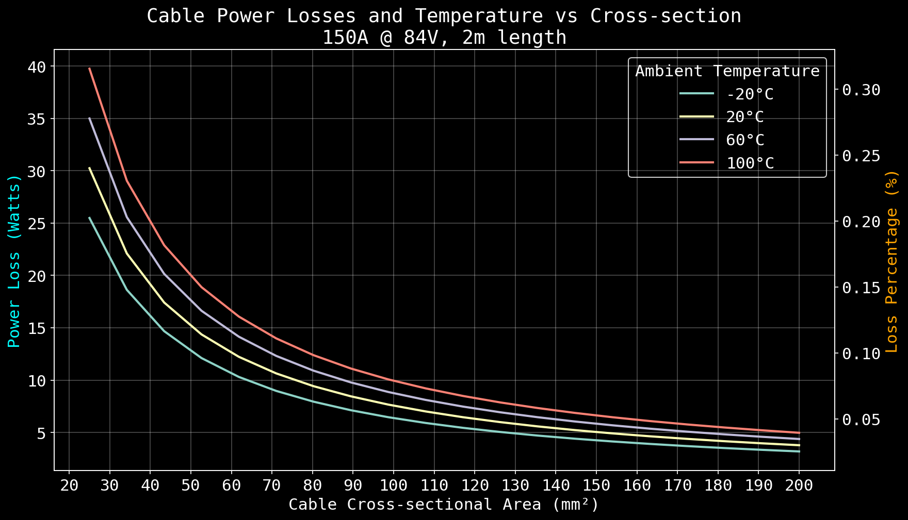

#+OPTIONS: \n:t
#+TITLE: Battery Design
#+LANGUAGE: en
#+AUTHOR: Ivan Nikolic
#+DATE: [2024-12-02 Mon]
#+LAST_MODIFIED: [2024-12-21 Sat]

* Cell selection

Collecting data on the individual cells from https://eu.nkon.nl/

#+NAME: cells
| Name                 | Price (EUR) | Cap (Ah) | Weight (g) | Max (A) |  Type | Height (mm) | D (mm) |
|----------------------+-------------+----------+------------+---------+-------+-------------+--------|
| LG INR18650MH1       |        2.75 |    3.100 |         47 |       6 | 18650 |        64.5 |     18 |
| Sanyo NCR18650GA     |         3.9 |    3.450 |         47 |      10 | 18650 |          65 |     18 |
| Keeppower IMR26650   |        8.95 |    5.200 |       93.9 |      15 | 26650 |          67 |     26 |
| Keeppower 26650      |        9.45 |    5.200 |         97 |      10 | 26650 |             |        |
| Lishen LR2170SD      |         3.8 |    4.800 |         73 |     9.6 | 21700 |        70.9 |   21.7 |
| Samsung INR21700     |        5.65 |    5.200 |         67 |      15 | 21700 |        70.6 |  21.27 |
| Samsung INR21700-50S |        3.16 |        5 |         72 |      35 | 21700 |        70.6 |  21.25 |
| Headway LifePO4      |          15 |   10.000 |        346 |      20 | 38120 |             |        |

* Full battery performance/price calculation

How many cells do I need to go in series to achieve min 3kWh capacity, then calculate max amps, weight etc

#+BEGIN_SRC python :var tab=cells :colnames yes :hlines yes :results table :exports both

import math

cell_voltage = 4.2
cell_series = 20
target_kwh = 3

def process(row):
    [name, price, capacity, weight, maxA, batt_type, height, diam] = row

    # full battery voltage (aiming for 72/84v)
    total_voltage = (cell_voltage * cell_series)
    
    # required capacity (Ah) of a single series stage to achieve target kWh
    single_series_ah = (target_kwh * 1000) / total_voltage
    
    # number of cells required in each stage
    P = math.ceil(single_series_ah / capacity)
    
    # total battery kWh
    kWh = (P *  capacity * total_voltage) / 1000

    # total cells in the battery
    cell_n = P * 20

    # full price, weight
    total_price = round(cell_n * price)
    total_weight = round(cell_n * weight) / 1000

    # max safe discharge
    total_maxA = P * maxA

    return [name, P, kWh, total_price, total_weight, total_maxA, cell_n]

return([['Name', '20SxP', 'kWh', 'Price (EUR)', 'Weight (Kg)', 'Max (A)', 'Cell Count']] + 
       [process(row) for row in tab])

#+END_SRC
#+RESULTS:
| Name                 | 20SxP |    kWh | Price (EUR) | Weight (Kg) | Max (A) | Cell Count |
|----------------------+-------+--------+-------------+-------------+---------+------------|
| LG INR18650MH1       |    12 | 3.1248 |         660 |       11.28 |      72 |        240 |
| Sanyo NCR18650GA     |    11 | 3.1878 |         858 |       10.34 |     110 |        220 |
| Keeppower IMR26650   |     7 | 3.0576 |        1253 |      13.146 |     105 |        140 |
| Keeppower 26650      |     7 | 3.0576 |        1323 |       13.58 |      70 |        140 |
| Lishen LR2170SD      |     8 | 3.2256 |         608 |       11.68 |    76.8 |        160 |
| Samsung INR21700-50S |     8 |   3.36 |         506 |       11.52 |     280 |        160 |
| Headway LifePO4      |     4 |   3.36 |        1200 |       27.68 |      80 |         80 |

Samsung INR21700 seems most promising:
- low price
- only 8 cells in series
- best performance in terms of max output (A) (implies very fast charging as well)
  
Building a 8P20S battery,
Max continuous discharge of 150A giving 7.2/8.4kw - 10/12.6kw

* Copper bus bar and cabling

We need to determine optimal current density (A/mm²)

- Constraints here are cable temperature increase and energy loss (W)
- Copper resistivity at 20°C (ρ₀) = 1.68 * 10⁻⁸Ωm (or 0.0168 Ω⋅mm²/m)
- Resistivity scales linearly with temperature ρ(T) = ρ₀[1 + α(T - T₀)]

Building a model of the wire as a python class

#+BEGIN_SRC python :results none :exports code :session losscalc
from dataclasses import dataclass

@dataclass
class Wire:
    length: float
    area_mm2: float
    temperature: float
    current: float
    voltage: float
    
    @property
    def area_m(self):
        return self.area_mm2 * 1e-6
    
    @property
    def resistance(self):
        rho_0 = 1.68e-8   # Reference resistivity at 20°C in Ω⋅m
        alpha = 0.00393   # Temperature coefficient of resistance
        T_0 = 20          # Reference temperature in °C
        resistivity = rho_0 * (1 + alpha * (self.temperature - T_0))
        
        return (resistivity * self.length) / self.area_m

    @property
    def power_loss(self):
        """Calculate power loss in a copper cable."""
        return (self.current ** 2) * self.resistance

    @property
    def current_density(self): # A/mm²
        return self.current / self.area_mm2

    @property
    def power(self): # w
        return self.current * self.voltage

    @property
    def power_loss_percent(self): # %
        return (self.power_loss / self.power) * 100
    
#+END_SRC

How do the power losses change with ambient temperatures and cable cross section?

Building a list of different wire sizes with a wide safety margin.

- temp: -20°C to 100°C
- crosssection 25mm² to 200mm²
- length: 2m
- power 12kW (150A @ 84V)

  
#+BEGIN_SRC python :var table=cable_losses :results file :exports both :session losscalc
def wire_matrix(area_mm2, temperature, current=150, voltage=84, length=2):
    # Ensure all inputs are arrays (convert scalars to single-value arrays)
    area_mm2 = np.asarray(area_mm2) if isinstance(area_mm2, (list, np.ndarray)) else np.array([area_mm2])
    temperature = np.asarray(temperature) if isinstance(temperature, (list, np.ndarray)) else np.array([temperature])
    current = np.asarray(current) if isinstance(current, (list, np.ndarray)) else np.array([current])
    voltage = np.asarray(voltage) if isinstance(voltage, (list, np.ndarray)) else np.array([voltage])
    length = np.asarray(length) if isinstance(length, (list, np.ndarray)) else np.array([length])

    # Generate grids for all parameter combinations
    L, A, T, C, V = np.meshgrid(length, area_mm2, temperature, current, voltage, indexing="ij")

    # Flatten grids and create Wire objects
    wires = [
        Wire(length=l, area_mm2=a, temperature=t, current=c, voltage=v)
        for l, a, t, c, v in zip(L.ravel(), A.ravel(), T.ravel(), C.ravel(), V.ravel())
    ]
    return wires

area_mm2 = np.linspace(25, 200, 20)
temperature = np.linspace(-20, 100, 4)
current = 150
voltage = 84
length = 2
wires = wire_matrix(area_mm2, temperature, current, voltage, length)

import matplotlib.pyplot as plt
from matplotlib.ticker import MultipleLocator

# Setup plot style
plt.style.use('dark_background')
plt.rcParams['font.family'] = 'monospace'
plt.rcParams['font.size'] = 15

# Create figure with primary and secondary y-axes
fig, ax1 = plt.subplots(figsize=(12, 7))
ax2 = ax1.twinx()

# Extract data
crosssection = [ wire.area_mm2 for wire in wires ]
loss =  [ wire.power_loss for wire in wires ]
loss_percentage =  [ wire.power_loss_percent for wire in wires ]

for temp in sorted({wire.temperature for wire in wires}):
    crosssection = [wire.area_mm2 for wire in wires if wire.temperature == temp]
    loss = [wire.power_loss for wire in wires if wire.temperature == temp]
    loss_percentage = [wire.power_loss_percent for wire in wires if wire.temperature == temp]
    line2 = ax2.plot(crosssection, loss_percentage, linewidth=0, color='orange', label='Loss Percentage')
    line = ax1.plot(crosssection, loss, linewidth=2, label=f'{temp}°C')
    
# Configure axes
ax1.set_xlabel('Cable Cross-sectional Area (mm²)')
ax1.set_ylabel('Power Loss (Watts)', color='cyan')
ax2.set_ylabel('Loss Percentage (%)', color='orange')

# Add grid
ax1.grid(True, which="major", ls="-", alpha=0.3)
ax1.grid(True, which="minor", ls=":", alpha=0.2)

# Set axis intervals
ax1.xaxis.set_major_locator(MultipleLocator(10))
ax1.yaxis.set_major_locator(MultipleLocator(5))

# Combine legends
lines = line1 + line2
labels = [l.get_label() for l in lines]
#ax1.legend(lines, labels, loc='upper right')
ax1.legend(title='Ambient Temperature', loc='upper right')

# Add title and adjust layout
plt.title(f'Cable Power Losses and Temperature vs Cross-section\n{current}A @ {voltage}V, {length}m length')

plt.tight_layout()

# Save and return
plt.savefig('cable_losses.png', dpi=150, bbox_inches='tight')
'cable_losses.png'

#+END_SRC
#+RESULTS:

Actually ambient temperature doesn't seem important.

We are well within the safety margins. I assume 15W of heating over 2 meters of cable with 50mm²/8.25mm diam seems nothing, losses are also nothing

- 3A per mm² gives us 0.14% losses, wasting 17.5W
- 2A per mm² gives us 0.09% losses, wasting 11.5W
- 1A per mm² gives us 0.04% losses, wasting 5.8W

#+BEGIN_SRC python :results table :exports both :session losscalc :results table
import numpy as np

def build_row(wire):
    return [
#        f"{int(wire.area_mm2)}",           # Area
#        f"{int(wire.current)}",            # Current
        f"{wire.current_density:.2f}",    # Current Density
#        f"{int(wire.voltage)}",            # Voltage
#        f"{int(wire.length)}",             # Length
        f"{wire.resistance*1000:.3f}",    # Resistance (mΩ)
        f"{wire.power_loss:.3f}",         # Power Loss
        f"{wire.power_loss_percent:.4f}", # Power Loss %
    ]

def build_wire(area_mm2, temperature, current=150, voltage=84, length=2):
    return [ Wire(length=length, area_mm2 = area_mm2, temperature=temperature, current=current, voltage=voltage) for area_mm2 in areas]

# Generate data
areas_mm2 = np.linspace(25, 200, 15)
temperatures = np.linspace(-20,100, 20)

temp_filter = lambda wire: wire.temperature == 20
rows = [build_row(wire) for wire in wires if temp_filter(wire)]

#wires = [build_wire(area, temperature) for temperature in temperatures for area in areas]
#rows = [build_row(wire) for wire in wires[3]]

# Print table header for org-babel
headers = ["A/mm²", 
        "mΩ", "Loss (W)", "Loss (%)"]

[headers, *rows]
#+END_SRC

#+RESULTS:
| A/mm² |    mΩ | Loss (W) | Loss (%) |
|  6.00 | 1.344 |   30.240 |   0.2400 |
|  4.38 | 0.982 |   22.098 |   0.1754 |
|  3.45 | 0.774 |   17.411 |   0.1382 |
|  2.85 | 0.638 |   14.364 |   0.1140 |
|  2.43 | 0.543 |   12.225 |   0.0970 |
|  2.11 | 0.473 |   10.640 |   0.0844 |
|  1.87 | 0.419 |    9.419 |   0.0748 |
|  1.68 | 0.376 |    8.449 |   0.0671 |
|  1.52 | 0.340 |    7.661 |   0.0608 |
|  1.39 | 0.311 |    7.007 |   0.0556 |
|  1.28 | 0.287 |    6.456 |   0.0512 |
|  1.19 | 0.266 |    5.985 |   0.0475 |
|  1.11 | 0.248 |    5.578 |   0.0443 |
|  1.04 | 0.232 |    5.223 |   0.0415 |
|  0.97 | 0.218 |    4.911 |   0.0390 |
|  0.92 | 0.206 |    4.634 |   0.0368 |
|  0.87 | 0.195 |    4.386 |   0.0348 |
|  0.83 | 0.185 |    4.163 |   0.0330 |
|  0.79 | 0.176 |    3.962 |   0.0314 |
|  0.75 | 0.168 |    3.780 |   0.0300 |

